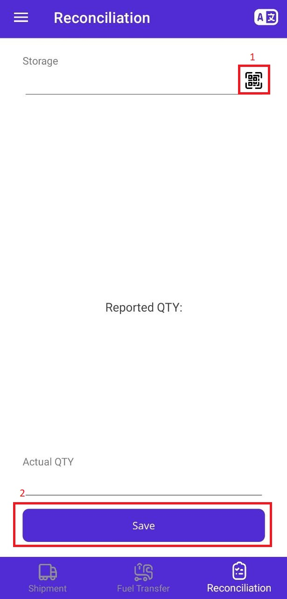

# Components

## Home Screen

<figure markdown>
  { width="300"}
  <figcaption>Home Screen</figcaption>
</figure>

1. Navigation Menu.
2. Icon Button for changing language.
3. Data Record Card.
4. Icon Buttons, from left to right:
    - Waste.
    - Evaporation.
    - Unload.
5. Mark as Arrived Icon Button.
6. Bottom Navigation Bar.

## Navigation Menu

<figure markdown>
  { width="300"}
  <figcaption>Navigation Menu</figcaption>
</figure>

1. Navigation Buttons to other screens.
2. Logout Flat Button.

## Fuel Transfer

<figure markdown>
  { width="300"}
  <figcaption>Fuel Transfer</figcaption>
</figure>

1. Selectable Field.
2. Text Field.
3. Icon Button to scan QR Code.
4. Flat Button to save the record.

## Date Picker

<figure markdown>
  { width="300"}
  <figcaption>Date Picker</figcaption>
</figure>

## Time Picker

<figure markdown>
  { width="300"}
  <figcaption>Time Picker</figcaption>
</figure>

## Reconciliation

<figure markdown>
  { width="300"}
  <figcaption>Reconciliation</figcaption>
</figure>

1. Icon Button to scan QR Code.
2. Flat Button to save the record.