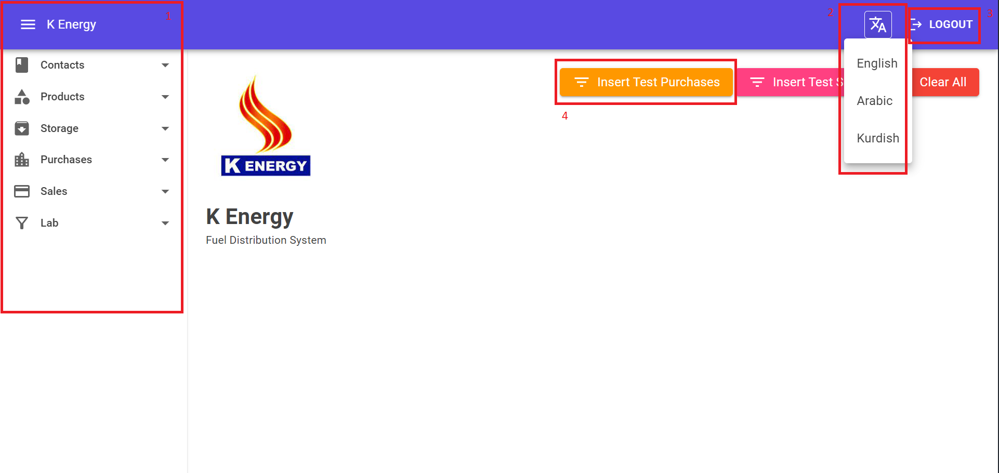
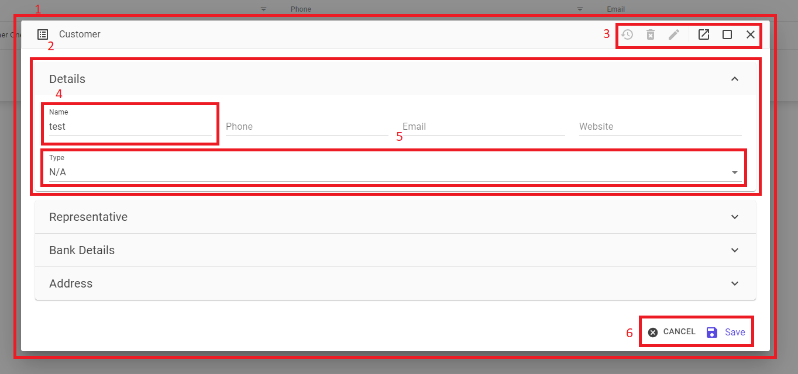
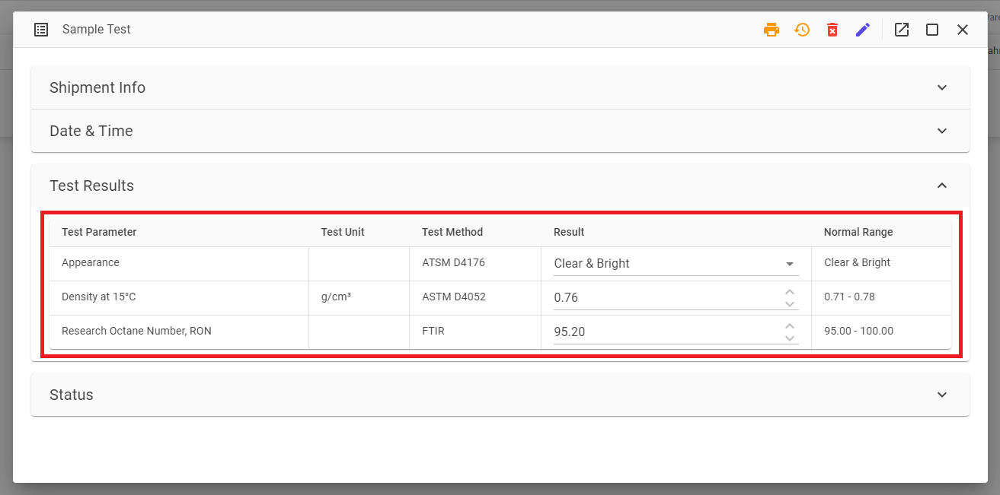

# Components

## Home Page

<figure markdown>
  
  <figcaption>Home Page</figcaption>
</figure>

1. Navigation Menu.
2. Drop Down Button.
2. Text Button.
4. Floating Button.

## Data Grids

### Data Grid Type 1

<figure markdown>
  
  <figcaption>Data Grid Type 1</figcaption>
</figure>

1. Data Grid.
2. Icon Buttons, from left to right:
    - Download Data Records.
    - Add New Record.
3. Flat Button to view the record.

### Data Grid Type 2

<figure markdown>
  
  <figcaption>Data Grid Type 2</figcaption>
</figure>

1. Icon Buttons, from left to right:
    - Reconciliation.
    - Transfer.

### Data Grid Type 3

<figure markdown>
  
  <figcaption>Data Grid Type 3</figcaption>
</figure>

1. Icon Buttons, from left to right:
    - View Data Record.
    - Unload.
    - Waste.
    - Evaporation.
2. Sample Test Icon Button.
3. Mark as Arrived Icon Button.

### Data Grid Type 4

<figure markdown>
  
  <figcaption>Data Grid Type 4</figcaption>
</figure>

1. In some places we have Data Grid inside forms.
2. Shipments Icon Button. This button opens a new form, that has a data grid inside showing all the shipment related to this data record.

## Form

<figure markdown>
  
  <figcaption>Form</figcaption>
</figure>

1. Form
2. Section
3. Icon Buttons, from left right:
    - View Revision
    - Delete
    - Edit
    - Open in New Tab
    - Maximize
    - Close
4. Text Field
5. Drop Down Field
6. Text Buttons, from left to right:
    - Cancel
    - Save

## Date Picker

<figure markdown>
  
  <figcaption>Date Picker</figcaption>
</figure>

## Time Picker

<figure markdown>
  
  <figcaption>Time Picker</figcaption>
</figure>

## Radio Button

<figure markdown>
  
  <figcaption>Radio Button</figcaption>
</figure>

1. Radio Button for changing status.
2. Icon Button for printing form.

## Table

<figure markdown>
  
  <figcaption>Table</figcaption>
</figure>

## Tabs

<figure markdown>
  
  <figcaption>Tabs</figcaption>
</figure>

## Pie Chart

<figure markdown>
  
  <figcaption>Pie Chart</figcaption>
</figure>