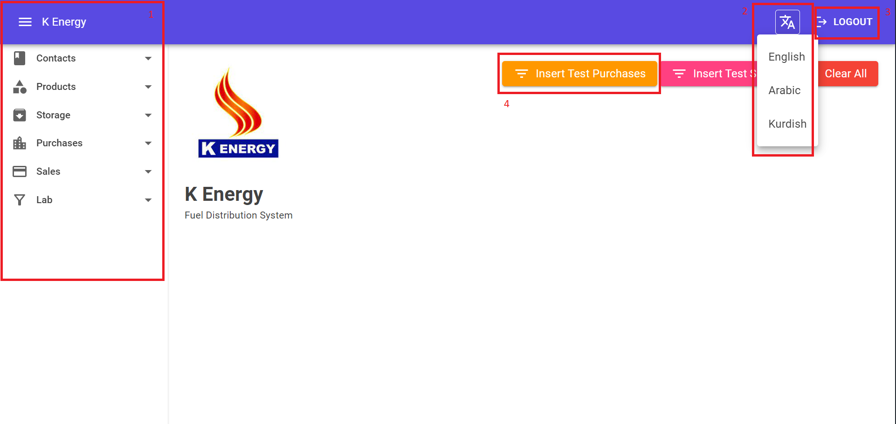
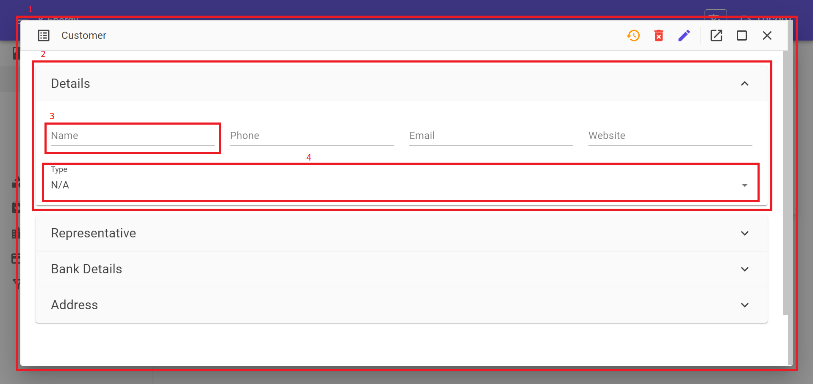
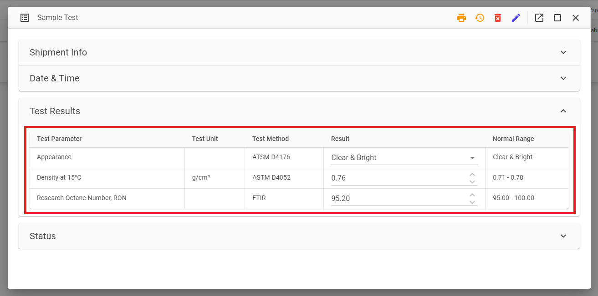
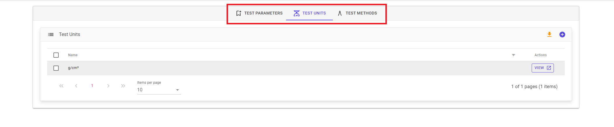

# Components

## Home Page

<figure markdown>
  
  <figcaption>Home Page</figcaption>
</figure>

1. Navigation Menu
2. Drop Down Button
2. Text Button
4. Floating Button

## Data Grid

<figure markdown>
  
  <figcaption>Data Grid</figcaption>
</figure>

1. Data Grid
2. Icon Button
3. Flat Button

## Form

<figure markdown>
  
  <figcaption>Form</figcaption>
</figure>

1. Form
2. Section
3. Text Field
4. Drop Down Field

## Date Picker

<figure markdown>
  
  <figcaption>Date Picker</figcaption>
</figure>

## Radio Button

<figure markdown>
  
  <figcaption>Radio Button</figcaption>
</figure>

## Table

<figure markdown>
  
  <figcaption>Table</figcaption>
</figure>

## Tabs

<figure markdown>
  
  <figcaption>Tabs</figcaption>
</figure>

## Pie Chart

<figure markdown>
  
  <figcaption>Pie Chart</figcaption>
</figure>